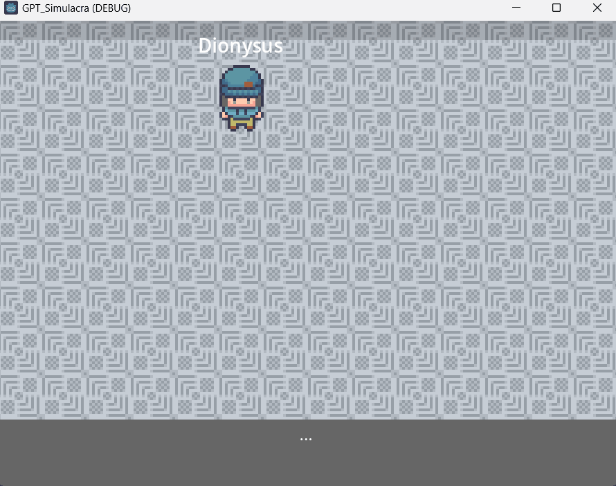

# GPT_Simulacra
RPG-style simulacra of interactions between GPTs for general experimentation.
Inspired by https://doi.org/10.1145/3586183.3606763.
Used Godot game engine for graphics.

### Demo
(As of 2023-12-16)

### Instructions to Run
1. Create `simulacra/api.key` file and insert your OpenAI key
2. `cd simulacra`
3. `python simulacra.py`
4. Run godot project
